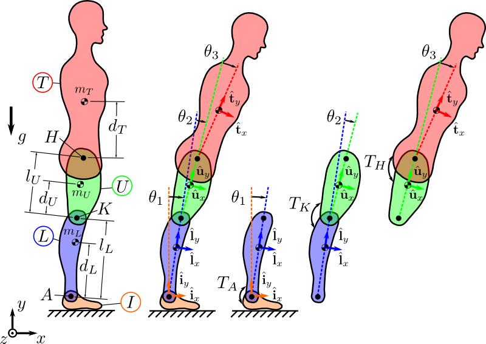

Introduction
============

This is the material for a tutorial on analyzing `multibody dynamics`_ with
scientific Python tools. It was first given as "Simulation and Control of
Biomechanical Systems with Python" at the `Midwest American Society of
Biomechanics Regional meeting
<http://www.uakron.edu/engineering/BME/ASB2014/>`_ on March 4th, 2014 in Akron,
Ohio. Modified versions have subsequently been given at PYCON2014, SCIPY2014,
and SCIPY2015.

.. _multibody dynamics: http://en.wikipedia.org/wiki/Multibody_system

The tutorial covers these main topics:

- Symbolic derivation of equations of motion for multibody systems.
- Numerical simulation of the resulting system.
- 3D visualization of the motion of the system.
- Optimal feedback control for stabilization.

The attendees will be exposed to various functionality of these Python tools:

- Python_
- The SciPy Stack: SymPy_, NumPy_, SciPy_, matplotlib_, IPython_
- PyDy_

.. _Python: http://www.python.org
.. _SymPy: http://www.sympy.org
.. _NumPy: http://numpy.scipy.org
.. _SciPy: http://www.scipy.org/scipylib/index.html
.. _matplotlib: http://matplotlib.org
.. _IPython: http://www.ipython.org
.. _PyDy: http://www.pydy.org

License
=======

All materials herein are licensed under `Create Commons Attribution 4.0`_.

.. _Create Commons Attribution 4.0: http://creativecommons.org/licenses/by/4.0/

Versions
========

A new version of the tutorial is typically created each time the tutorial is
given to incorporate feedback from the attendees and for software updates.
These versions can be downloaded from:

https://github.com/pydy/pydy-tutorial-human-standing/releases

Example Problem
===============

The tutorial will go through the PyDy workflow in small steps. At the end the
students should have a working 3-link 2D inverted pendulum model of a human
that can be used for balancing studies. The free body diagram of the model is
shown below:

Installation
============

Python Packages
---------------

To run these notebooks the `SciPy Stack`_ is required. To obtain the needed
packages, we are recommending users install the `Anaconda Scientific Python
Distribution`_ which contains most of the necessary software and eases cross
platform installation. You should install Anaconda to your home directory. The
installation directory can simply be deleted when the tutorial is over if you
no longer want the files.

.. _SciPy Stack: http://www.scipy.org/stackspec.html
.. _Anaconda Scientific Python Distribution: https://store.continuum.io/cshop/anaconda/

First, `download and install Anaconda <http://continuum.io/downloads>`_ for
your operating system. After Anaconda is installed, update various packages to
the latest versions by issuing this command in a terminal::

   $ conda update numpy scipy sympy matplotlib ipython-notebook ipywidgets

Now install the latest PyDy with::

   $ conda install -c pydy pydy

MathJax
-------

**This is only required if you want to run the tutorial without internet
access.**

These notebooks make use of the MathJax_ javascript library to render and
display mathematics. By default IPython loads MathJax from the internet (i.e.
from a CDN), however, because of potentially questionable internet access at
the conference we recommend you install MathJax locally. To do so, type the
following in a terminal::

   $ conda install mathjax

.. _MathJax: http://www.mathjax.org/

Web Browser
-----------

If you want to see the 3D visualizations you must use a WebGL compliant
browser. Visit http://get.webgl.org/ to see if your current browser supports
WebGL. If not, you will need to upgrade or install another browser. Visit
http://caniuse.com/webgl to choose a suitable browser. We've only confirmed the
following:

**Linux**

Latest versions of Firefox and Chrome work.

**Mac OSX**

Latest version Firefox works.

**Windows**

Latest version of Chrome works and IE 11 works.

We know that some OS browser combinations do not work. See
https://github.com/pydy/pydy/issues/36 for more details.

Download the tutorial
=====================

Either download the latest zipped tutorial materials from:

https://github.com/pydy/pydy-tutorial-human-standing/archive/master.zip

Or download the specific release for your conference from:

https://github.com/pydy/pydy-tutorial-human-standing/releases

and then extract the zip file.

Use
===

From the terminal, navigate to the extracted tutorial directory, for example::

   $ cd /home/username/pydy-tutorial-human-standing

Check the environment
---------------------

To make sure your software environment is correctly setup, run the
`check_env.py` script in a terminal with::

   $ python check_env.py

If no errors are returned, then you've correctly installed the software and can
run the tutorial. If errors appear, then install or upgrade the software as
needed.

Open a terminal window in the ``notebooks`` directory and type::

   $ cd notebooks
   $ ipython notebook

Your web browser should open and you see a list of all the notebooks and can
click to open them and execute.

Notebooks
=========

These are the notebooks for the tutorial.

- [15 min] n00_python_intro.ipynb_
- [14 min] n01_dynamics_overview.ipynb_
- [ 4 min] n02_problem_introduction.ipynb_
- [39 min] n03_kinematics.ipynb_
- [18 min] n04_inertia.ipynb_
- [25 min] n05_kinetics.ipynb_
- [25 min] n06_equations_of_motion.ipynb_
- [32 min] n07_simulation.ipynb_
- [25 min] n08_visualization.ipynb_
- [28 min] n09_control.ipynb_

.. _n00_python_intro.ipynb: http://nbviewer.ipython.org/github/pydy/pydy-tutorial-human-standing/blob/master/notebooks/n00_python_intro.ipynb
.. _n01_dynamics_overview.ipynb: http://nbviewer.ipython.org/github/pydy/pydy-tutorial-human-standing/blob/master/notebooks/n01_dynamics_overview.ipynb
.. _n02_problem_introduction.ipynb: http://nbviewer.ipython.org/github/pydy/pydy-tutorial-human-standing/blob/master/notebooks/n02_problem_introduction.ipynb
.. _n03_kinematics.ipynb: http://nbviewer.ipython.org/github/pydy/pydy-tutorial-human-standing/blob/master/notebooks/n03_kinematics.ipynb
.. _n04_inertia.ipynb: http://nbviewer.ipython.org/github/pydy/pydy-tutorial-human-standing/blob/master/notebooks/n04_inertia.ipynb
.. _n05_kinetics.ipynb: http://nbviewer.ipython.org/github/pydy/pydy-tutorial-human-standing/blob/master/notebooks/n05_kinetics.ipynb
.. _n06_equations_of_motion.ipynb: http://nbviewer.ipython.org/github/pydy/pydy-tutorial-human-standing/blob/master/notebooks/n06_equations_of_motion.ipynb
.. _n07_simulation.ipynb: http://nbviewer.ipython.org/github/pydy/pydy-tutorial-human-standing/blob/master/notebooks/n07_simulation.ipynb
.. _n08_visualization.ipynb: http://nbviewer.ipython.org/github/pydy/pydy-tutorial-human-standing/blob/master/notebooks/n08_visualization.ipynb
.. _n09_control.ipynb: http://nbviewer.ipython.org/github/pydy/pydy-tutorial-human-standing/blob/master/notebooks/n09_control.ipynb
